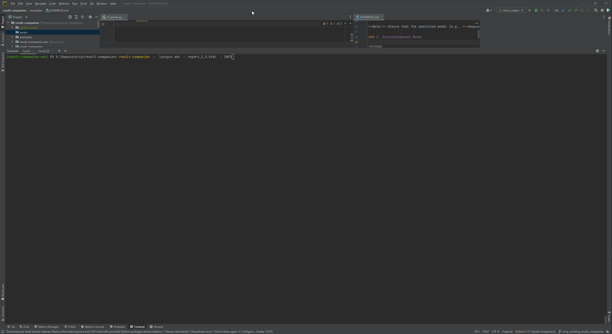

# Result Companion

## Overview

**Result Companion** is an open-source project designed to help test and QA engineers leverage Large Language Models (LLMs) for analyzing and identifying potential issues in their test suites written in Robot Framework. The project integrates Robot Framework’s internal API and LangChain to build a flexible, experimental layer that allows users to experiment with both local and cloud-based LLM models.

The package reads test artifacts from `output.xml` files and recursively analyzes all test cases, including logs, to draw solid conclusions around test failures. It then generates a `log.html` file that uses a native yet slightly enhanced HTML template, making it easy for Robot Framework users to understand the test results, with additional expandable fields generated by LLMs.

One of the key features is that users can customize the behavior of the application by altering the system prompt and other parameters, greatly expanding the capabilities of Result Companion.



## Features

- **Integration with Robot Framework**: Analyzes test cases and logs from Robot Framework's `output.xml`.
- **LLM-Powered Insights**: Utilizes LLM models to generate deeper insights, patterns, and potential issues in test suites.
- **Flexible Model Layer**: Experiment with local or cloud-based LLM models using LangChain.
- **Customizable Prompts**: Adjust system prompts and parameters to adapt the tool to different needs and expand its capabilities.
- **Enhanced HTML Output**: Generates an enhanced HTML report with expandable sections for better understanding.
- **Local LLM Model Support**: Primarily tested with the `ollama` package and local LLM models like `deepseer-r1` or `llama3.2`.

## Installation

To install Result Companion, follow these steps:

### Prerequisites
1. Install [Poetry](https://python-poetry.org/docs/#installation) for managing dependencies and virtual environments.
   
   If you don't have Poetry installed, you can install it via:
   ```bash
   curl -sSL https://install.python-poetry.org | python3 -
   ```

2. Create a virtual environment:
    ```bash
    python -m venv result-companion-env && source result-companion-env/bin/activate  # For Linux/macOS result-companion-env\Scripts\activate  # For Windows
    ```
3. Install the required dependencies with Poetry:
    ```bash
   python -m poetry install
   ```
   This will create a virtual environment and install all the necessary dependencies for the Result Companion project.

### Local Model Installation
To use the **Deepseer-r1** model locally, follow these steps:

#### Step 1: Install Ollama
Ollama is required to manage and run local models. You can install Ollama based on your operating system:

- **For macOS**:
  Download the installer directly:
  ```bash
  brew install ollama
  ```

- **For Windows and Linux**:
  Visit [Ollama's official website](https://ollama.ai) and follow the installation instructions.

Verify that Ollama is installed correctly:
```bash
ollama --version
```

#### Step 2: Install the Deepseer-r1 Model
Once Ollama is installed, you can download and install the Deepseer-r1 model by running the following command in your terminal:

```bash
ollama run deepseek-r1:1.5b
```

This will download the model and prepare it for use locally.

#### Step 3: Verify Installation
To confirm that the Deepseer-r1 model is installed, run:
```bash
ollama list
```

The output should include the `deepseer-r1` model, indicating it is ready for use.

### Notes
- Ensure that your system meets the hardware requirements for running Ollama and the Deepseer-r1 model (e.g., sufficient GPU memory).
- If you encounter issues, refer to the [Ollama Documentation](https://ollama.ai/docs) for troubleshooting.

With these steps completed, your environment is set up for both the project and local model usage.


## Usage

### Running Result Companion

After installation, you can run Result Companion to analyze your Robot Framework test artifacts. 

Example command:
```bash
result-companion -o output.xml -r log_with_results.html
```

For more detailed usage and additional configuration options, refer to the `examples/` folder in the repository, which includes different example setups and use cases. You can find the relevant README file there for further instructions.

## Local LLM Model Support

The project is primarily tested with local LLM models using the `ollama` package. The best model for local usage is `deepseer-r1`, available at:

- **Deepseer-r1**: [Ollama's Deepseer-r1](https://ollama.com/library/deepseek-r1)

The model comes in various sizes, and the 7B parameter version (or larger) is preferred for optimal performance. Keep in mind that the model's performance also depends on the hardware on which it runs.

## Security and Privacy Considerations

When using LLMs, especially in local or cloud-based environments, it is crucial to consider the potential exposure of sensitive or private data. LLMs may inadvertently expose private information or intellectual property if used without proper precautions. Users are advised to evaluate and address these risks thoroughly before utilizing this application.

Before using Result Companion or any LLM-based tool, you should:

- Be mindful of the data being processed by the model and ensure it does not contain sensitive or proprietary information unless you are confident in the security of the environment.
- Familiarize yourself with the privacy and data-sharing policies of the LLM you are using, whether it is a local or cloud-based model.
- If using cloud-based models, ensure that any proprietary or sensitive data is encrypted or anonymized before being shared.
- Review the documentation and known risks associated with the specific LLM model and provider to ensure compliance with your organization’s privacy policies.

**Disclaimer**:  
The creator of this package takes no responsibility for any exposure of private data, intellectual property, or sensitive information resulting from the use of this application. By using Result Companion, you acknowledge and accept all associated risks, including but not limited to the potential leakage of data to public internet or third-party services. Users run this application at their own risk and are fully responsible for ensuring the security and privacy of their data.

## Limitations

- **Textual Data Only**: The current version of the project only supports handling textual data. Non-textual artifacts, such as images or binary logs, are not supported.

- **Token Limitations**: LLMs have token constraints, which can be problematic when dealing with long logs. To address this, a chunking functionality has been introduced. However:
  - For **local runs**, chunking slows down execution significantly due to the computational overhead.
  - For **third-party services** accessed via REST APIs, chunking increases network traffic and may lead to excessive costs.

- **Single Test Case Analysis**: For local runs, the LLM analyzes only one test case at a time. This is due to the computational expense of processing multiple cases, and parallelization does not currently yield significant performance improvements.


## Contributing

Feel free to contribute to Result Companion! You can:

- Fork the repository.
- Create a feature branch.
- Submit a pull request with your improvements.

For bug reports or feature requests, please open an issue on the GitHub repository.

## License

Result Companion is licensed under the [Apache 2.0 License](LICENSE).

---

For further documentation, including setup instructions and configuration examples, please visit the [Examples](examples/EXAMPLES.md) folder in the repository.
