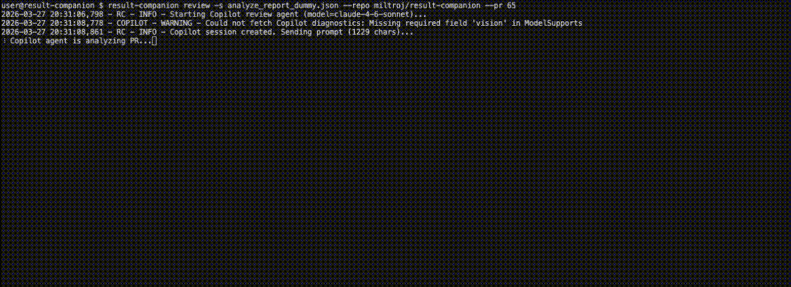
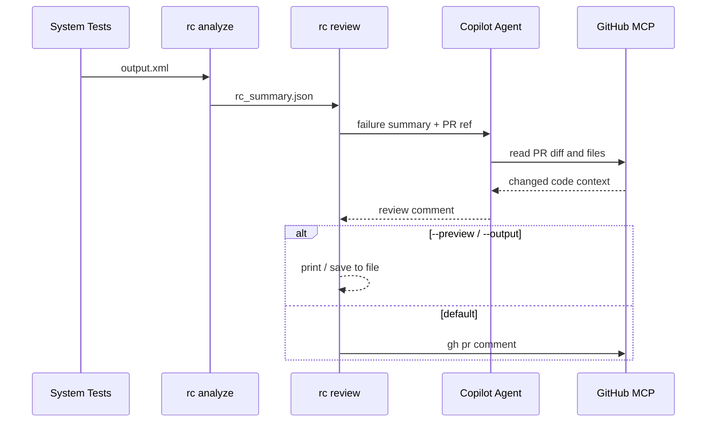

# PR Review — From Failure to Root Cause in Seconds



Your Robot Framework tests know *what* broke. The Copilot agent figures out *why* — by cross-referencing failures with the PR diff.

Currently uses the GitHub Copilot agent flow. Support for other providers may be added later.

## What It Does

1. `result-companion analyze --json-report` creates a structured failure report.
2. `result-companion review` parses the JSON and sends a text summary to a Copilot agent.
3. The agent reads the PR through GitHub MCP and writes a Markdown review comment.
4. Without `--preview`: posts the comment with `gh pr comment`. With `--preview`: prints it to stdout (and optionally saves to file via `--output`).



## Prerequisites

`copilot-cli` and `gh` (authenticated) are both required. `gh` validates that the repo and PR exist before starting the Copilot agent.

macOS:

```bash
brew install copilot-cli              # required
brew install gh                       # required (PR validation + posting)
```

Linux — see [gh installation](https://github.com/cli/cli/blob/trunk/docs/install_linux.md) and [copilot-cli releases](https://github.com/github/gh-copilot/releases).

```bash
copilot -i "/login"
gh auth login                         # required
```

## Local Usage

```bash
# 1. Analyze Robot Framework results
result-companion analyze -o output.xml --json-report rc_summary.json

# 2. Print the generated review comment without posting it
result-companion review \
  -s rc_summary.json \
  --repo owner/repo \
  --pr 65 \
  --preview

# 3. Post the review comment to the PR
result-companion review \
  -s rc_summary.json \
  --repo owner/repo \
  --pr 65

# 4. Save review to a Markdown file for editing before posting
result-companion review \
  -s rc_summary.json \
  --repo owner/repo \
  --pr 65 \
  --preview \
  -o review.md

# 5. Post an all-clear comment when all tests pass
result-companion review \
  -s rc_summary.json \
  --repo owner/repo \
  --pr 65 \
  --notify-on-pass
```

`--preview` validates the PR exists and calls Copilot. It only skips the `gh pr comment` step.
`-o review.md` saves the generated comment to a file. Works with or without `--preview`.

## Behaviour by Scenario

| Scenario | Result Reviewer |
|----------|--------|
| Failures found | Copilot analyzes → comment posted to PR |
| Failures + `--preview` | Copilot analyzes → comment printed, not posted |
| No failures | Skipped |
| No failures + `--notify-on-pass` | All-clear comment posted (no Copilot call) |

`--preview` applies to `--notify-on-pass` too. `--output` can be added to any scenario — it saves the comment to a file without affecting other behaviour.

## GitHub Actions

`--repo` defaults to `GITHUB_REPOSITORY`, so in Actions you usually only need `--pr`:

```yaml
- run: |
    result-companion analyze -o output.xml --json-report rc_summary.json
    result-companion review -s rc_summary.json --pr ${{ github.event.pull_request.number }}
```

## Configuration

Default review config lives in `result_companion/core/configs/default_review_config.yaml`.
Override it with `--config custom.yaml`:

```yaml
review:
  model: "gpt-5-mini"
  timeout: 300
  startup_timeout: 30
  mcp_server_url: "https://api.enterprise.githubcopilot.com/mcp/readonly"
  review_prompt: |
    You are a QA assistant. Robot Framework tests failed after
    PR #{pr_number} in {repo_name}.
    ...
```

Available runtime placeholders:

- `{repo_name}`
- `{pr_number}`
- `{failure_summary}`

## Common Failures

If `gh` is missing:

```text
GitHub CLI is not installed. Install `gh` before posting review comments.
```

If `gh` is installed but unauthenticated:

```bash
gh auth login
```

If Copilot startup or auth fails:

```bash
copilot -i "/login"
```

If the repo or PR number does not exist:

```text
PR #6511 not found in owner/repo. Verify the repo and PR number exist.
```

If the summary file is not valid JSON (e.g. a plain text file), `review` exits with:

```text
Review failed: Invalid summary: expected JSON from 'analyze --json-report'.
```

If the generated comment is empty, `result-companion review` fails instead of silently
posting nothing.

## JSON Report Structure

`--json-report` produces a structured file consumed by `review`:

```json
{
  "failed_test_count": 1,
  "analyzed_tests": ["Login With Valid Credentials"],
  "per_test_results": {"Login With Valid Credentials": "Root cause: 503 from backend..."},
  "overall_summary": "Backend service unavailable during login flow.",
  "model": "openai/gpt-4",
  "source_file": "output.xml",
  "total_test_count": 12,
  "source_hash": "a1b2c3d4e5f6",
  "timestamp": "2026-03-24T14:30:00+00:00"
}
```

| Field | Description |
|-------|-------------|
| `failed_test_count` | Number of failed tests analyzed by LLM |
| `analyzed_tests` | List of analyzed test names |
| `per_test_results` | LLM analysis per test (name → text) |
| `overall_summary` | Cross-test failure synthesis (optional) |
| `model` | LLM model used for analysis |
| `source_file` | Path to input `output.xml` |
| `total_test_count` | Total tests before pass/fail filtering |
| `source_hash` | SHA-256 prefix of raw test data (traceability) |
| `timestamp` | UTC ISO-8601 timestamp of when analysis completed |

## Programmatic API

Use `review()` from Python with pre-built objects — no file paths or JSON parsing:

```python
from result_companion import review
from result_companion.core.parsers.config import ReviewConfigModel, ReviewPromptModel
from result_companion.core.results.text_report import AnalyzeReport

report = AnalyzeReport(
    failed_test_count=1,
    analyzed_tests=["Login With Valid Credentials"],
    per_test_results={"Login With Valid Credentials": "503 from backend"},
)

config = ReviewConfigModel(
    version=1.0,
    review=ReviewPromptModel(
        review_prompt="PR #{pr_number} in {repo_name}.\n{failure_summary}",
        model="gpt-5",
    ),
)

comment = review(
    repo_name="owner/repo",
    pr_number=65,
    report=report,
    config=config,
    preview=False,
)
```

`review()` returns the generated comment as a string. With `preview=True` (default), it skips posting to the PR.

### Parameters

| Parameter | Default | Description |
|-----------|---------|-------------|
| `repo_name` | (required) | GitHub repo in `owner/repo` format |
| `pr_number` | (required) | Pull request number |
| `report` | (required) | `AnalyzeReport` object |
| `config` | (required) | `ReviewConfigModel` object |
| `preview` | `True` | Skip posting comment to PR |
| `notify_on_pass` | `False` | Post all-clear comment when no failures |
| `output_path` | `None` | Save comment to file |
| `quiet` | `False` | Suppress spinner output |

## Limitations

- Review is Copilot-only.
- `gh pr comment` cannot upload `rc_log.html` as a PR attachment.
- If you want reviewers to download `rc_log.html`, publish it separately as a CI artifact
  or provide your own hosted link in workflow output or PR discussion.
